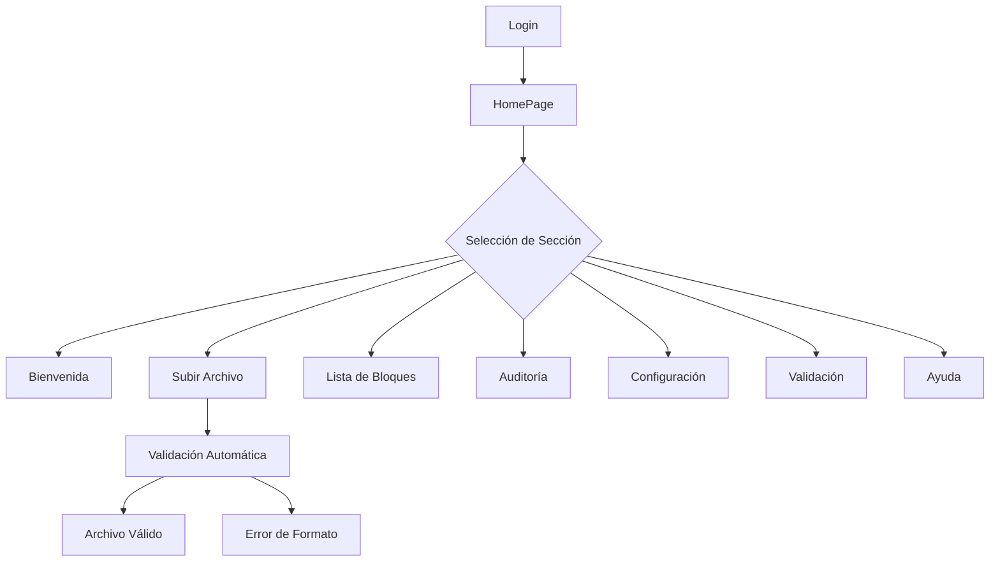

# 📱 Sistema Blockchain Universitario

## 🏢 Información del Proyecto

**Nombre:** Block-chain  
**Versión:** 0.0.0  
**Tipo:** Sistema Web de Gestión Blockchain  
**Universidad:** ESPE (Escuela Politécnica del Ejército)  
**Carrera:** Ingeniería en Sistemas  

## 👥 Equipo de Desarrollo

| Nombre | Rol | Especialidad | GitHub | LinkedIn |
|--------|-----|--------------|--------|----------|
| **Mesias** | Desarrollador | Frontend Specialist | [@AMVMesias](https://github.com/AMVMesias) | [LinkedIn](https://www.linkedin.com) |
| **Julio** | Desarrollador | Backend Expert | [@JulioViche](https://github.com/JulioViche) | [LinkedIn](https://www.linkedin.com) |
| **Denise** | Diseñadora | UI/UX Designer | [@DeniseRea](https://github.com/DeniseRea) | [LinkedIn](https://www.linkedin.com) |

## 📋 Descripción

Sistema web moderno desarrollado en React para la gestión y validación de archivos en una blockchain universitaria. Incluye funcionalidades de carga de archivos, validación automática, auditoría de la cadena, configuración del sistema y un sistema de ayuda completo.

## ✨ Características Principales

### 🎨 **Interfaz de Usuario**
- ✅ Modo oscuro/claro con persistencia en localStorage
- ✅ Diseño responsive y moderno
- ✅ Navegación vertical fija con iconos intuitivos
- ✅ Efectos hover y animaciones suaves
- ✅ Tema adaptativo con colores consistentes

### 🔧 **Funcionalidades Core**
- 🏠 **Página de Bienvenida**: Dashboard principal con información del equipo y mascota
- 📤 **Carga de Archivos**: Soporte para .txt, .json, .csv con validación automática
- 📋 **Lista de Bloques**: Visualización de la cadena de bloques
- 🔍 **Auditoría**: Validación e integridad de la blockchain
- ⚙️ **Configuración**: Personalización del sistema
- ⭐ **Validación**: Procesamiento y verificación de archivos
- 👤 **Ayuda**: Sistema de soporte con FAQ y guías

### 🛡️ **Validación y Seguridad**
- Validación automática de formatos de archivo
- Verificación de integridad de la blockchain
- Alertas visuales para diferentes estados
- Procesamiento seguro de archivos

## 🛠️ Tecnologías Utilizadas

### **Frontend Framework**
```json
"react": "^19.1.0"
"react-dom": "^19.1.0"
```

### **Enrutamiento**
```json
"react-router-dom": "^7.6.3"
```

### **Estilos y UI**
```json
"bootstrap": "^5.3.7"
"react-icons": "^5.5.0"
```

### **Validación**
```json
"prop-types": "^15.8.1"
```

### **Alertas y Notificaciones**
```json
"sweetalert2": "^11.22.2"
```

### **Herramientas de Desarrollo**
```json
"vite": "^6.3.5"
"@vitejs/plugin-react": "^4.4.1"
"eslint": "^9.25.0"
```

## 🚀 Instalación y Configuración

### **Prerrequisitos**
- Node.js (versión 16 o superior)
- npm o yarn
- Git

### **Pasos de Instalación**

1. **Clonar el repositorio**
```bash
git clone [URL_DEL_REPOSITORIO]
cd Block-chain
```

2. **Instalar dependencias**
```bash
npm install
```

3. **Configurar variables de entorno** (opcional)
```bash
# Crear archivo .env en la raíz del proyecto
VITE_API_URL=tu_api_url_aqui
```

4. **Ejecutar en modo desarrollo**
```bash
npm run dev
```

5. **Construir para producción**
```bash
npm run build
```

6. **Previsualizar build de producción**
```bash
npm run preview
```

## 🗂️ Estructura del Proyecto

```
Block-chain/
├── public/
│   └── vite.svg
├── src/
│   ├── assets/
│   │   ├── ESPEcito.png
│   │   ├── profile.png
│   │   ├── react.svg
│   │   └── user_michi.png
│   ├── components/
│   │   ├── NavBar/
│   │   │   ├── NavBar.jsx
│   │   │   └── NavItem.jsx
│   │   ├── Table/
│   │   │   ├── AuditRow.jsx
│   │   │   ├── TableBody.jsx
│   │   │   ├── TableContainer.jsx
│   │   │   ├── TableHeader.jsx
│   │   │   └── TableRow.jsx
│   │   ├── BlockCard.jsx
│   │   ├── Button.jsx
│   │   ├── FileInput.jsx
│   │   ├── ImageDisplay.jsx
│   │   ├── InputField.jsx
│   │   ├── MascotCard.jsx
│   │   ├── SectionTitle.jsx
│   │   ├── SelectInput.jsx
│   │   ├── TeamCarousel.jsx
│   │   ├── TeamMemberCard.jsx
│   │   ├── ThemeToggle.jsx
│   │   └── ValidationAlert.jsx
│   ├── context/
│   │   └── ThemeContext.jsx
│   ├── images/
│   │   └── mascota.png
│   ├── pages/
│   │   ├── Config/
│   │   │   └── ConfigPage.jsx
│   │   ├── Help/
│   │   │   ├── ContactSection.jsx
│   │   │   ├── FAQSection.jsx
│   │   │   ├── HelpPage.jsx
│   │   │   └── QuickGuideSection.jsx
│   │   ├── Home/
│   │   │   └── HomePage.jsx
│   │   ├── ListBlock/
│   │   │   └── ListBlock.jsx
│   │   ├── Login/
│   │   │   ├── LoginForm.jsx
│   │   │   └── LoginPage.jsx
│   │   ├── Update/
│   │   │   └── UpdatePage.jsx
│   │   ├── Validation/
│   │   │   ├── AuditPage.jsx
│   │   │   └── ValidationPage.jsx
│   │   └── Welcome/
│   │       └── WelcomePage.jsx
│   ├── styles/
│   │   └── theme.css
│   └── main.jsx
├── eslint.config.js
├── index.html
├── package.json
├── README.md
└── vite.config.js
```

## 🎯 Funcionalidades Detalladas

### **1. Sistema de Temas (ThemeContext)**
- Modo claro y oscuro
- Persistencia en localStorage
- Colores adaptativos para todos los componentes
- Transiciones suaves entre temas

### **2. Navegación (NavBar)**
- Barra vertical fija
- Iconos intuitivos con tooltips
- Efectos hover y estado activo
- Navegación entre secciones

### **3. Carga de Archivos (UpdatePage)**
- Soporte para archivos .txt, .json, .csv
- Validación de formato automática
- Previsualización del contenido
- Botón de carga con efectos visuales

### **4. Validación (ValidationPage)**
- Validación automática al cargar archivo
- Estados visuales claros (válido/inválido/vacío)
- Previsualización del contenido del archivo
- Botón de procesamiento

### **5. Auditoría (AuditPage)**
- Tabla de bloques con estados
- Validación de integridad de la cadena
- Alertas visuales para errores
- Información detallada de cada bloque

### **6. Sistema de Ayuda (HelpPage)**
- FAQ con acordeón adaptativo
- Guías rápidas con botones interactivos
- Información de contacto
- Diseño responsive

## 🎨 Sistema de Diseño

### **Colores del Tema**

#### Modo Claro
```css
background: #ffffff
text: #343a40
primary: #007bff
secondary: #6c757d
success: #28a745
danger: #dc3545
warning: #ffc107
info: #17a2b8
```

#### Modo Oscuro
```css
background: #1f2937
text: #f9fafb
card: #374151
border: #4b5563
```

### **Tipografía**
- Font Awesome para iconos
- Bootstrap para componentes base
- Fuentes del sistema para texto

### **Efectos y Animaciones**
- Transiciones CSS de 0.3s
- Efectos hover con scale y sombras
- Animaciones de entrada fade-in
- Estados activos con colores destacados

## 🔄 Flujo de Usuario



## 🧪 Scripts Disponibles

```bash
# Desarrollo
npm run dev          # Inicia servidor de desarrollo

# Construcción
npm run build        # Construye para producción
npm run preview      # Previsualiza build

# Calidad de Código
npm run lint         # Ejecuta ESLint
```

## 📱 Responsive Design

El sistema está optimizado para:
- 📱 **Móviles**: 320px - 767px
- 📱 **Tablets**: 768px - 1023px
- 💻 **Desktop**: 1024px+

## 🛡️ Buenas Prácticas Implementadas

### **Código**
- Componentes funcionales con hooks
- PropTypes para validación de props
- ESLint para calidad de código
- Estructura modular y reutilizable

### **Performance**
- Lazy loading de componentes
- Optimización de re-renders
- CSS minificado en producción
- Imágenes optimizadas

### **Accesibilidad**
- Roles ARIA adecuados
- Contraste de colores accesible
- Navegación por teclado
- Tooltips informativos

## 🚨 Solución de Problemas Comunes

### **Error: Module not found**
```bash
npm install
npm run dev
```

### **Puerto en uso**
```bash
# Vite automáticamente busca el siguiente puerto disponible
# Verifica en la consola qué puerto está usando
```

### **Problemas de CSS**
- Verificar que Bootstrap esté correctamente importado
- Comprobar que Font Awesome esté cargado
- Revisar la configuración del tema

## 📈 Futuras Mejoras

- [ ] Implementación de API real para blockchain
- [ ] Sistema de autenticación robusto
- [ ] Notificaciones push
- [ ] Exportación de reportes
- [ ] Dashboard de analytics
- [ ] Modo offline
- [ ] PWA (Progressive Web App)

## 📄 Licencia

Este proyecto es desarrollado con fines académicos para la Universidad ESPE.

## 📞 Soporte

Para soporte técnico o consultas:
- 📧 **Email**: soporte@blockapp.com
- 🐛 **Reportar bugs**: Crear issue en el repositorio
- 💬 **Consultas**: Contactar al equipo de desarrollo

---

**Desarrollado con ❤️ por el equipo de Ingeniería en Sistemas - ESPE**
